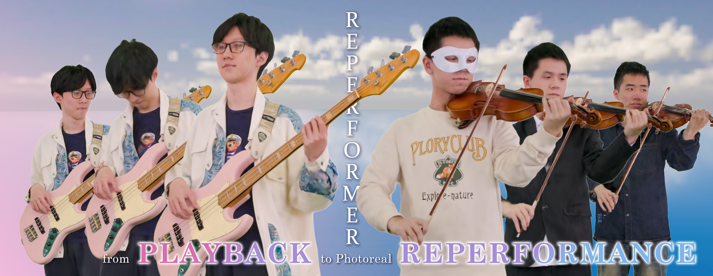

# [CVPR 2025] RePerformer: Immersive Human-centric Volumetric Videos from Playback to Photoreal Reperformance
[Yuheng Jiang*](https://nowheretrix.github.io/), [Zhehao Shen*](https://moqiyinlun.github.io/), [Chengcheng Guo](https://github.com/gcccccccccccc12345), [Yu Hong](https://github.com/xyi1023), [Zhuo Su](https://suzhuo.github.io/index.html), [Yingliang Zhang](https://scholar.google.com/citations?user=SJJwxTQAAAAJ&hl=en), [Marc Habermann†](https://people.mpi-inf.mpg.de/~mhaberma/), [Lan Xu†](http://xu-lan.com/)<br>
| [Webpage](https://moqiyinlun.github.io/Reperformer/) | [Full Paper](https://arxiv.org/abs/2503.12242v1) |
[Video](https://www.youtube.com/watch?v=CZKqSiivlTc) |
<br>


## Overview
Official implementation of [Reperformer](https://arxiv.org/abs/2503.12242v1) (RePerformer: Immersive Human-centric Volumetric Videos from Playback to Photoreal Reperformance)

We introduce Reperformer, a novel 3DGS-based approach for generating human-centric volumetric videos from dense multi-view inputs. It provides realistic playback and can vividly reperform the non-rigid scenes driven by similar yet unseen motions. Given a dynamic sequence with dense footage, Reperformer can not only deliver accurate free-view playback but also realistically re-perform the dynamic scene under similar yet novel motions. Our approach begins by disentangling motion/appearance Gaussians and repacking the attributes of the appearance Gaussians into 2D maps using a Morton-based 2D parameterization. For network training, we adopt the U-Net architecture to learn a generalizable mapping from the position maps to the attribute maps. For re-performance, we adopt a semantic-aware alignment module to associate the motion Gaussians of a new performer with the original appearance Gaussians, enabling seamless transfer and photorealistic rendering. To handle more generalized cases, we propose a semantic-aware motion transfer module based on the motion Gaussian proxy, leveraging the U-Net generalization capability for re-performance.

## Cloning the Repository

The repository contains submodules, thus please check it out with 
```shell
# HTTPS
git clone https://github.com/HiFi-Human/Reperformer.git --recursive
```
or
```shell
# SSH
git clone git@github.com:HiFi-Human/Reperformer.git --recursive
```

## Setup

Our provided install method is based on Conda package and environment management:

Create a new environment
```shell
conda create -n reperformer python=3.10
conda activate reperformer
```
First install CUDA and PyTorch, our code is evaluated on CUDA 11.8 and PyTorch 2.1.2+cu118. Then install the following dependencies:
```shell
conda install pytorch==2.1.2 torchvision==0.16.2 torchaudio==2.1.2 pytorch-cuda=11.8 -c pytorch -c nvidia
pip install submodules/diff-gaussian-rasterization
pip install submodules/simple-knn
pip install submodules/fused-ssim
pip install -r requirements.txt
```

## Dataset
Our code mainly evaluated on multi-view human centric datasets including [HiFi4G](https://github.com/moqiyinlun/HiFi4G_Dataset) and [DualGS](https://github.com/xyi1023/DualGS_Dataset) datasets. Please download the data you needed.

The overall file structure is as follows:
```shell
<location>
├── image_white
│    ├── %d                - The frame number, starts from 0.
│    │   └──%d.png         - Masked RGB images for each view. View number starts from 0.
│    └── transforms.json   - Camera extrinsics and intrinsics in instant-NGP format.
│
├── image_white_undistortion
│    ├── %d                - The frame number, starts from 0.
│    │   └──%d.png         - Undistorted maksed RGB images for each view. View number starts from 0.
│    └── colmap/sparse/0   - Camera extrinsics and intrinsics in Gaussian Splatting format.
```

## Training

```shell
python train.py \
  -s <path to HiFi4G or DualGS dataset> -m <output path> \
  --frame_st 30 --frame_ed 1500 \
  --iterations 30000 --subseq_iters 15000 \
  --training_mode 0 \
  --parallel_load \
  --map_resolution 512 \
  -r 1
```

We have also provided a training script example to streamline the training process. You can find this example in the file training_script.sh, which automates running the training for different configurations and modes.
</details>
Note that to achieve better training results, it is recommended to use undistorted images(image_white_undistortion) for training. 

### Core Parameters
| Parameter | Type | Description |
|-----------|------|-------------|
| <code style="white-space: nowrap;">--iterations</code> | int | Total training iterations for the **first frame** of JointGS training.|
| <code style="white-space: nowrap;">--subseq_iters</code> | int | Training iterations per frame for **subsequent frames** after the first frame. |
| <code style="white-space: nowrap;">--frame_st</code> | int | Start frame number. |
| <code style="white-space: nowrap;">--frame_ed</code> | int | End frame number. |
| <code style="white-space: nowrap;">--map_resolution</code> | int | The resolution of morton map for the UNet training. |
| <code style="white-space: nowrap;">--unet_iterations</code> | int | The number of iterations to train the UNet. |
| <code style="white-space: nowrap;">--training_mode</code> | {0,1,2,3,4} | Training pipeline selection:<br>- <code>0</code>: All stage.<br>- <code>1</code>: jointGS only.<br>- <code>2</code>: Preprocess only. <br>- <code>3</code>: Unet only.<br>- <code>4</code>: Evaluation only.|
| <code style="white-space: nowrap;">--ply_path</code> | str | The path to the point cloud used for initialization (defaults to points3d.ply in the dataset). |
| <code style="white-space: nowrap;">--motion_folder</code> | str | If you already have a trained JointGS and want to train only SkinGS, you can use this parameter to manually specify the path to JointGS. |
| <code style="white-space: nowrap;">--parallel_load</code> | flag | Enables multi-threaded image loading during dataset loading. |

The results are as follows:
```shell
<location>
├── track
│    └── ckt                   - The results of JointGS.
│    │   ├── point_cloud_0.ply            
│    │   ...
│    │   └── point_cloud_n.ply  
│    └──                    - The results of JointGS.
│    ├── cameras.json    
│    └── cfg_args
├── save_ply                   - The results of Unet Evaluation.
│    ├── point_cloud_0.ply            
│    ...
│    └── point_cloud_n.ply   
├── morton_map                 - The canonical gaussian and its morton map
│    ├── 2d_map.png            - The position map(visualization)
│    ├── order.npy             - The sort index
│    ├── point_cloud.ply       - The sorted canonical gaussian
│    ├── pos.npy               - The position map
│    ├── rotation.npy          - The rotation map
│    ├── u.npy                 - The u-axis order
│    └── v.npy                 - The v-axis order
├── cameras.json    
└── cfg_args
```


## Evaluation
### Render
```shell
python render.py -m <path to trained model> -st <start frame number> -e <end frame number> --parallel_load # Generate renderings
```
You are able to select the desired views by using the --views parameter.

### Evaluate
```shell
python scripts/evaluation.py -g <path to gt> -r <path to renderings> # Compute error metrics on renderings
```
## Viewer

### Installation

Our modified Viewer is located in the `DynamicGaussianViewer/` directory.  
The build process is identical to that of the official Gaussian Splatting repository.

To compile the viewer, please follow the official instructions:  
👉 [https://github.com/graphdeco-inria/gaussian-splatting](https://github.com/graphdeco-inria/gaussian-splatting)

```bash
cd DynamicGaussianViewer/
# Follow the same steps as in the official repo to build the viewer
```
### Usage
```
./install/bin/SIBR_gaussianViewer_app_rwdi.exe -m <path to the folder where cfg_args and cameras.json exist> -d <path to point clouds folder> -start <start frame> -end <end frame> 
# optional: --step 1 --rendering-size 1920 1080 
```

## Acknowledgments
We would like to thank the authors of [Taming 3DGS](https://github.com/humansensinglab/taming-3dgs) for their excellent implementation, which was used in our project to replace the original 3DGS for acceleration. We also thank the authors of [DualGS](https://github.com/HiFi-Human/DualGS), as our codebase is built upon their framework.

## License

This project contains code from multiple sources with distinct licensing terms:

### 1. Original Gaussian Splatting Code
The portions of code derived from the original [Gaussian Splatting](https://github.com/graphdeco-inria/gaussian-splatting) implementation are licensed under the **Gaussian Splatting Research License**.  
📄 See: [LICENSE.original](LICENSE.original.md)

### 2. Our Modifications and Additions
All code modifications, extensions, and new components developed by our team are licensed under MIT License.  
📄 See: [LICENSE](LICENSE.md)

<section class="section" id="BibTeX">
  <div class="container is-max-desktop content">
    <h2 class="title">BibTeX</h2>
    <pre><code>@inproceedings{jiang2025reperformer,
  title={RePerformer: Immersive Human-centric Volumetric Videos from Playback to Photoreal Reperformance},
  author={Jiang, Yuheng and Shen, Zhehao and Guo, Chengcheng and Hong, Yu and Su, Zhuo and Zhang, Yingliang and Habermann, Marc and Xu, Lan},
  booktitle={Proceedings of the Computer Vision and Pattern Recognition Conference},
  pages={11349--11360},
  year={2025}
}</code></pre>
  </div>
</section>

